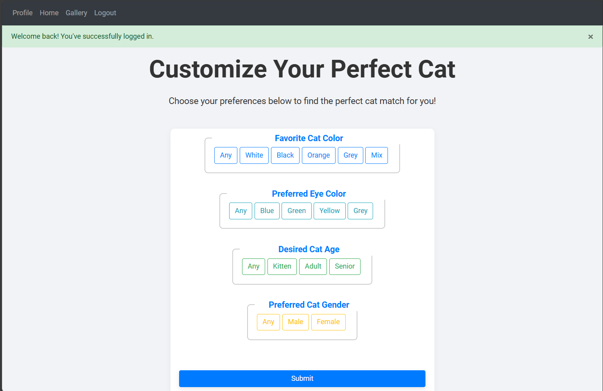
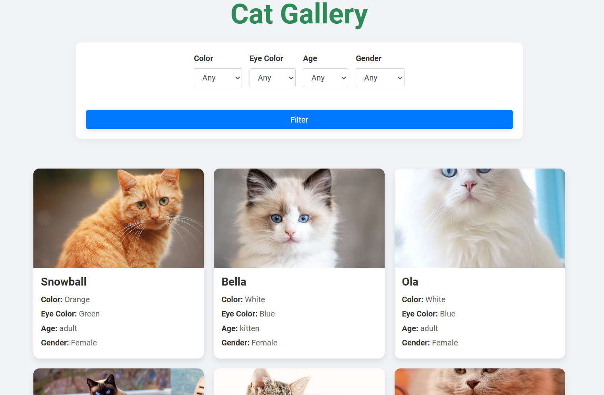
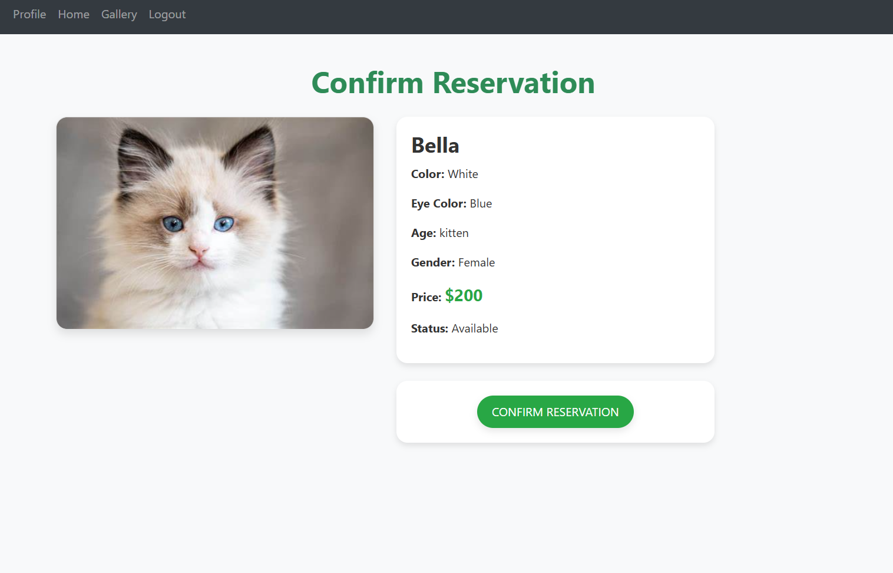
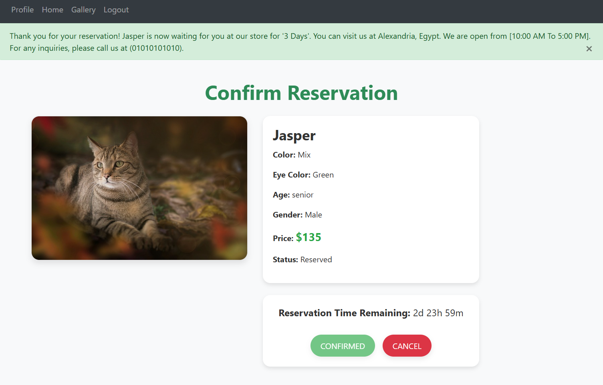

# 🐾 Cat Store Web Application

Welcome to **Cat Store**, the web application where you can reserve adorable cats with just a click! Built with Python and Flask, this project was a personal challenge to integrate a full stack of technologies, learn advanced features of web development, and explore best practices.

## 💻 Tech Stack

Here’s the technology stack that powers Cat Store:

-   **Backend:** Python, Flask, SQLAlchemy
-   **Frontend:** HTML5, CSS3, Bootstrap 4.4.1, Font Awesome 4.7.0
-   **Database:** SQLite
-   **Version Control:** Git, GitHub
-   **Deployment:** Coming Soon!

## 📜 Project Features

-   **User Authentication**: Secure registration and login with Flask-Login and hash password storage.
-   **Cat Reservation**: Browse through the gallery of cats, apply filters, and reserve your favorite.
-   **Image Management**: Each cat is associated with an image dynamically fetched from the database.
-   **Responsive Design**: Built with Bootstrap, the application is fully responsive across devices.
-   **Pagination**: Implemented pagination to improve user experience when navigating large data sets.

<details>
  <summary><b>🚀 Deployment & Future Iterations</b></summary>

Currently, the project is running locally on WSL using Flask's development server. However, the next step is deploying the application on platforms like Heroku or AWS.

**Future Iterations:**

-   Add a shopping cart for customers to purchase accessories.
-   Integrate a payment gateway for online transactions.
-   Expand the database to include a wider variety of pets beyond cats.
</details>

## 🎯 Challenges & Learnings

This project pushed my boundaries in multiple ways. I started with the basics of Flask but quickly expanded into pagination, authentication, and making a professional front-end design. I spent quite some time debugging issues around user input validation, form handling, and managing state across sessions.

**One major challenge** I faced was getting the pagination right when filtering cats by specific attributes like color or gender. The combination of SQLAlchemy queries with Flask's `paginate()` method took a while to perfect.

## 📈 Database Design

The **Cat** table in the database stores the following attributes:

-   ID
-   Name
-   Color
-   Eye Color
-   Age
-   Gender
-   Image Filename
-   Price

Each cat in the database is dynamically linked with its image and reservation status.

<p>

</p>

</details>

## 📸 Gallery Design

The gallery displays cat images, with each image clickable to initiate the reservation process. The design uses a responsive grid layout with three images per row.

<p>

</p>

To enhance user experience:

-   **Images auto-adjust**: Each image scales to fit within predefined bounds.
-   **Click-to-Reserve**: When a user clicks on an image, they are taken to the confirm reservation page with the selected cat's details.
<p>

</p>
<p>

</p>

### 🛠 Setup Instructions

<details>
  <summary><b>🔧 Local Setup</b></summary>

1. **Clone the repository:**

    ```bash
    git clone https://github.com/username/Cat_Store.git
    cd Cat_Store
    ```

2. **Set up a virtual environment:**

    - For **Linux/macOS**:

        ```bash
        python3 -m venv venv
        source venv/bin/activate
        ```

    - For **Windows**:
        ```bash
        python -m venv venv
        venv\Scripts\activate
        ```

3. **Install the dependencies:**

    ```bash
    pip install -r requirements.txt
    ```

4. **Run the Flask application:**

    ```bash
    flask run
    ```

5. **Access the application in your browser:**

    Open `http://localhost:5000` to see Cat Store in action.

</details>
